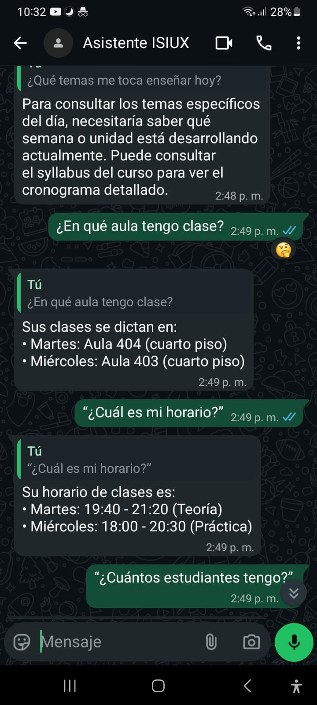
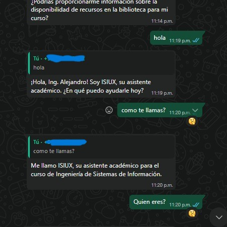
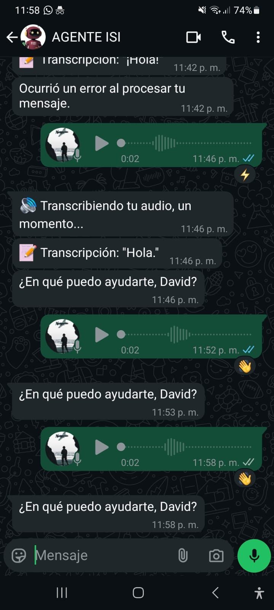
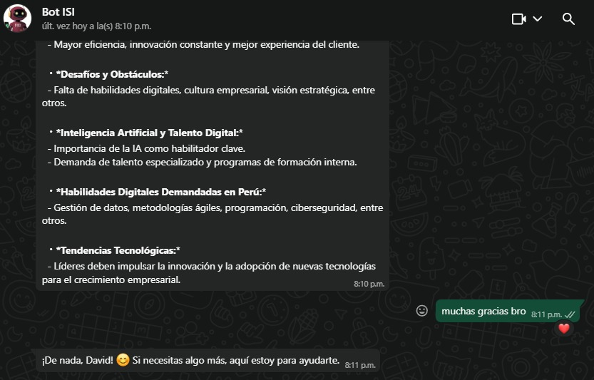
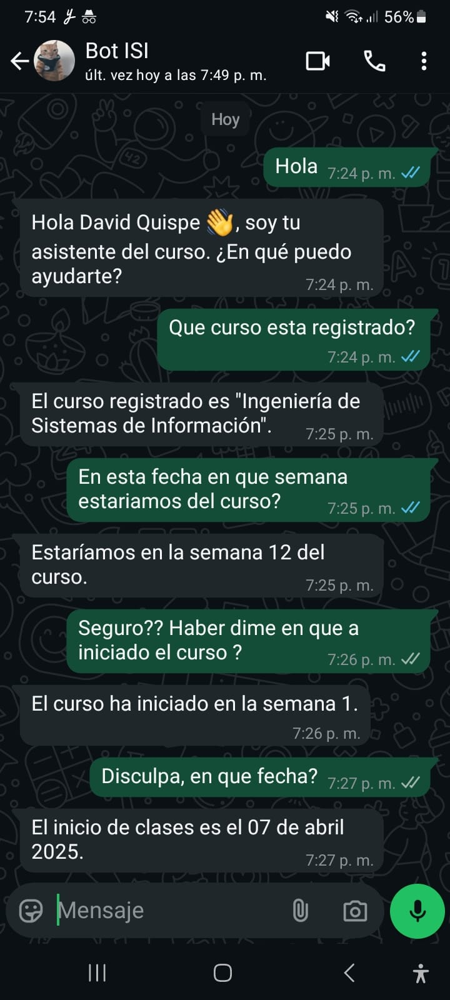
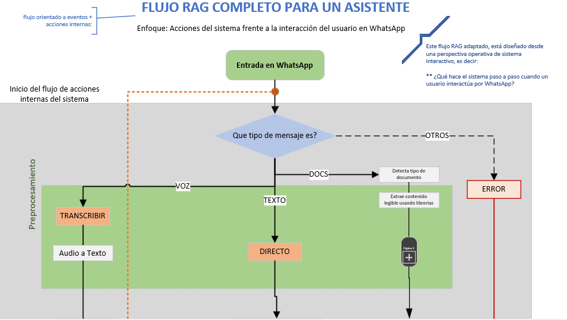

# ISIUX - Asistente Académico Inteligente

Este proyecto implementa **ISIUX**, un asistente virtual basado en Inteligencia Artificial (RAG) integrado en WhatsApp, diseñado específicamente para optimizar la comunicación y gestión académica en la carrera de Informatica

---
Este proyecto nace de la necesidad de que estudiantes como docentes enfrentan desafíos constantes en la gestión de la información:
*   **Dispersión de información:** Los horarios, sílabos, materiales de clase y reglamentos están en diferentes plataformas o archivos.
*   **Respuestas inmediatas:** Los estudiantes requieren respuestas rápidas sobre temas logísticos (aulas, horarios) o académicos (temas de examen) fuera del horario de clase.
*   **Carga docente:** Los profesores reciben preguntas repetitivas que podrían automatizarse.

**ISIUX** nace para centralizar esta información y entregarla de manera conversacional, natural y precisa a través del canal más usado: **WhatsApp**.

---
El asistente inteligente que utiliza una arquitectura **RAG (Retrieval-Augmented Generation)**. Esto significa que no solo "conversa" como ChatGPT, sino que tiene acceso a una **biblioteca privada de documentos oficiales del curso y/o facultad**:

*   **Horarios y Aulas:** Sabe dónde y cuándo son las clases.
*   **Syllabus y Malla:** Conoce los temas, unidades y prerrequisitos.
*   **Materiales de Clase:** "Lee" los PDFs de las diapositivas semana a semana para responder preguntas específicas sobre el contenido dictado.

### Demo








---

## Cómo Funciona

El sistema opera en tres capas principales:

1.  **Interfaz (WhatsApp):** Utiliza `whatsapp-web.js` para simular un cliente de WhatsApp. No requiere API oficial de pago.
2.  **Cerebro (Lógica + IA):**
    *   Identifica al usuario (Docente vs Estudiante) para personalizar la respuesta.
    *   Si la pregunta es logística (horarios), responde con reglas rápidas.
    *   Si la pregunta es académica, busca en la base de datos vectorial (`embeddings`) los fragmentos más relevantes de los PDFs/JSONs y usa **OpenAI GPT** para generar la respuesta final.
3.  **Datos (Base de Conocimiento):**
    *   Scripts en Python procesan los PDFs de las clases.
    *   Scripts en Node.js generan los "embeddings" (índices matemáticos) para la búsqueda semántica.
    
---

## Estructura Principal del Proyecto

Solo se muestran los directorios y archivos más relevantes para entender la arquitectura:

```
asistenteOrganizacional/
├── src/
│   ├── ClienteWhatsApp.js         # Punto de entrada principal. Inicia el cliente de WhatsApp.
│   ├── handlers/
│   │   ├── ManejadorMensajes.js   # Cerebro lógico. Decide si responder con regla o con IA.
│   │   └── ConstructorPrompts.js  # Prepara las instrucciones para GPT.
│   ├── db/                        # Base de Datos Local (JSONs)
│   │   ├── usuarios_sistema/      # Usuarios permitidos (whitelist) y sus roles.
│   │   ├── datos_operativos/      # Horarios y Base de Conocimiento procesada.
│   │   ├── materiales_curso/      # PDFs crudos y JSONs procesados de las clases.
│   │   └── embeddings/            # Vectores para la búsqueda semántica (IA).
│   └── utils/
│       ├── busquedaSemantica.js   # Motor de búsqueda. Encuentra la info relevante para la IA.
│       └── openaiClient.js        # Conexión con la API de OpenAI.
├── .env                           # Variables de entorno (API Keys).
└── package.json
```

---

## Instalación y Puesta en Marcha

### Prerrequisitos
*   Node.js (v18 o superior)
*   Una cuenta de OpenAI con créditos (API Key).
*   Un celular con WhatsApp instalado (para escanear el QR).

### Pasos

1.  **Clonar y preparar:**
    ```bash
    git clone <repo_url>
    cd asistenteOrganizacional
    npm install
    ```

2.  **Configurar Variables:**
    Crea un archivo `.env` en la raíz basado en el ejemplo:
    ```env
    OPENAI_API_KEY=tu_api_key_aqui
    NOMBRE_ASISTENTE=ISIUX
    ```

3.  **Registrar Usuarios:**
    Edita `src/db/usuarios_sistema/BaseDatosUsuarios.json` y agrega los números de teléfono permitidos (con código de país, ej: `51999...`) y su rol (`estudiante` o `docente`).

4.  **Ejecutar:**
    ```bash
    npm run dev
    ```

5.  **Vincular:**
    Escanea el código QR que aparecerá en la terminal con tu WhatsApp (Dispositivos Vinculados).

---

## Flujo de Actualización de Datos

Si se agregan nuevos materiales (PDFs de nuevas semanas):
1.  Colocar los PDFs en `src/db/materiales_curso/materiales_python/entrada_pdfs/`.
2.  Ejecutar los scripts de procesamiento (Python) para extraer el texto.
3.  Ejecutar `node src/db/embeddings/generarEmbeddingsMateriales.js` para actualizar la "memoria" del bot.
